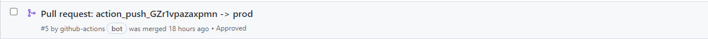
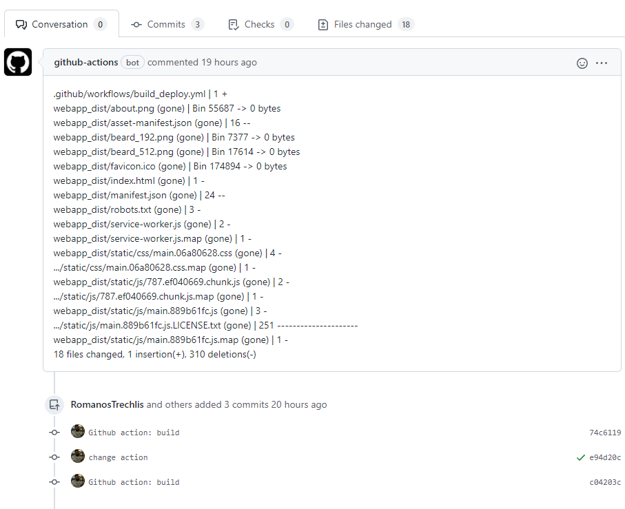

# React build, push and pull-request

Build a React web app, push the result to a branch, and create a pull request to another.

## Usage

The following example *.yml* configuration should be inside *.github/workflow* directory of your project.

```yaml
name: Deploy website
on:
  push:
    # Sequence of patterns matched against refs/tags
    tags:
      - 'v*' # Push events to matching v*, i.e. v1.0, v20.15.10
jobs:
  build:
    name: Deploying to website
    runs-on: ubuntu-latest
    steps:
      - uses: actions/checkout@v2
      - uses: RomanosTrechlis/actions-react-build-push@master
        env:
          GITHUB_TOKEN: ${{ secrets.GITHUB_TOKEN }}
```

## Configuration

The following parameters can be passed under the *with* section.

| key                	| description                                                                                             	 | required 	| default value 	|  options 	|
|--------------------	|-----------------------------------------------------------------------------------------------------------|:--------:	|---------------	|:--------:	|
| package_manager    	| Select the package manager to use for building the web application                                      	 |    NO    	| yarn          	| yarn/npm 	|
| build_command      	| Input the command for building the project                                                              	 |    NO    	| yarn build    	|     -    	|
| push_branch_prefix 	| Prefix for the automatically created branch                                                             	 |    NO    	| action_push   	|     -    	|
| pr_branch          	| The name of the branch to pull request, should already exist                                            	 |    NO    	| master        	|     -    	|
| pr_title           	| The title for the new pull request                                                                      	 |    NO    	| -             	|     -    	|
| build_directory    	| Specify the name of the directory to contain the generated artifacts (should not be in .gitignore file) 	 |    NO    	| webapp_dist   	|     -    	|

This is an example that creates a pull request to the branch *prod* and to the build directory *docs*.

```yaml
name: Deploy website
on:
  push:
    # Sequence of patterns matched against refs/tags
    tags:
      - 'v*' # Push events to matching v*, i.e. v1.0, v20.15.10
jobs:
  build:
    name: Deploying to website
    runs-on: ubuntu-latest
    steps:
      - uses: actions/checkout@v2
      - uses: RomanosTrechlis/actions-react-build-push@master
        env:
          GITHUB_TOKEN: ${{ secrets.GITHUB_TOKEN }}
        with:
          build_directory: docs
          pr_branch: prod
          package_manager: npm
          build_command: npm run build
```

## Github pull requests

The following pull request will be created, and can be approved and merged.



In this image is displayed the description of the pull request.



It is created by the diff between the *pr_branch* and the generated branch.

## Future functionality

+ push to a different repository

## License

This project is distributed under the [MIT License](LICENSE)